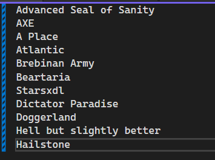
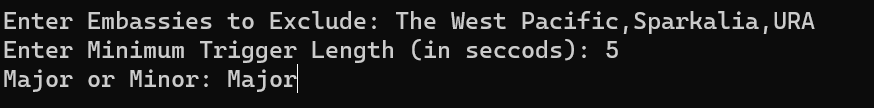
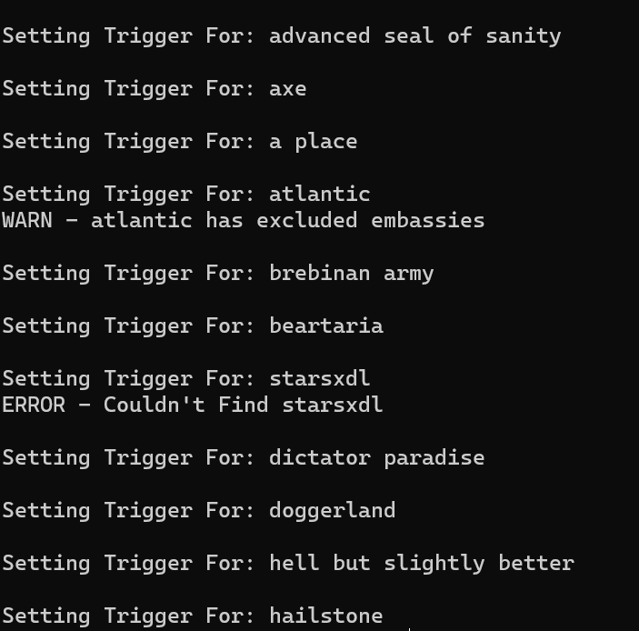
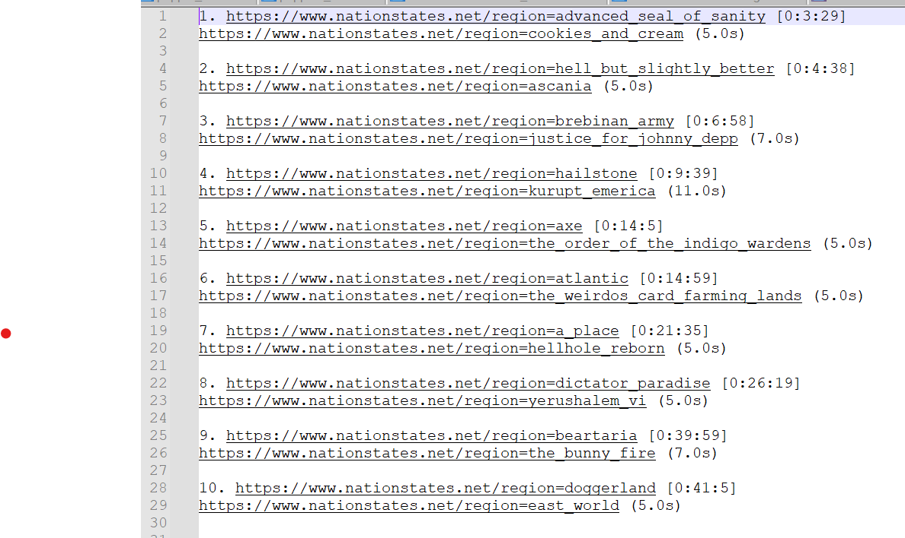

# QuickSnipe
QuickSnipe is a python script for efficient trigger setting of specific targets.

## Requirements
This project uses the Pandas library, which can be installed via
`pip install pandas`
This repository provides a Spyglass sheet which can be used for testing, however replacing it with a more recent sheet is highly reccomended for actual trigger use.
Spyglass can be found **[here](https://github.com/Derpseh/Spyglass)**
Make sure to rename the sheet to `sheet.xlsx` when replacing.

## Use
**Step 1:** Pick your regions and place them in `regions.txt` like so

**Step 2:** Run `QuickSnipe.py` and specify parameters. Regions to exclude should be seperated by commas ONLY. Trigger Length currently specifies the minimum trigger length. Quick Snipe will only pick a longer trigger if it can't find one of the specified length, and will never go shorter. All inputs are not case-sensitive.

**Step 3:** Wait for the program to pick your triggers. Regions which contain excluded embassies will display a warning message in the console, but this message is only cosmetic. It will still pull triggers for it and add it to the trig sheet. It is up to the user to investigate and choose to remove the flagged regions from the run or not. Regions which don't exist in the Spyglass sheet will be skipped with an Error message.

**Step 4:** The finished raid file will be placed in the trigsheets folder. Its name will be the date it was generated.

## Development and Issues
This tool is still under development. It has been tested in the battlefeild and worked sucesfully, and so is considered to be ready enough to be used. I do not, however, at this point consider it to be complete.
If you encounter any unexpected behavhiour while using it, please report it. If you have desired features, please suggest them.

## Acknowledgements

This tool would not exist without [QuickDraw](https://github.com/Aptenodyte/Quickdraw) by Aptenodyte, the original trigger setting tool, which inspired this one.
